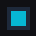

# Icon Library for Splunk Dashboard Studio

A Splunk Cloud–ready icon toolkit for Dashboard Studio. Three ways to use it:

1. **Custom visualization** — a Canvas-rendered panel for any of **3,879 Material Symbols** icons with configurable color, size, background shape, shadow, glow, label, alignment, rotation, threshold coloring, threshold effects (icon swap / glow scale / pulse), and click drilldown via Studio `setToken`.
2. **Bundled SVG asset catalog** — the same 3,879 icons shipped as static SVG files at `/static/app/icon_library/icons/<category>/<name>.svg`. Drop the URL into any Studio `splunk.image` element, asset slot, HTML module, or CSS `background-image`. No iframe overhead, ideal for high-density dashboards.
3. **CSV lookup** — `| inputlookup icon_catalog` exposes the full catalog as a Splunk lookup with `name, category, path, tags, popularity` columns. Search by tag, filter by category, or enumerate icons programmatically from SPL.

The icon font ([Material Symbols Outlined](https://fonts.google.com/icons)) is base64-embedded in `visualization.css` — no external network requests, no CORS issues, Splunk Cloud compatible. The SVG catalog ships inside the app, also fully offline.



## Installation

1. Download `icon_library-<version>.tar.gz` from the `dist/` folder
2. In Splunk Web: **Apps → Manage Apps → Install app from file**
3. Upload the `.tar.gz` and restart Splunk when prompted

For Splunk Cloud: submit the package through the Cloud vetting process.

## Quick Start

1. Open **Dashboard Studio** and create or edit a dashboard
2. Add a panel and set the visualization type to **Icon Library** (`icon_library.icon_library`)
3. **Set `"backgroundColor": "transparent"` in the panel options** (see note below)
4. Pick an icon from the **Icon (Popular)** dropdown — or type any [Material Symbols](https://fonts.google.com/icons) name in the **Custom Icon Name** field
5. Adjust color, background, glow, shadow, and label in the formatter sidebar

The visualization works **with or without** an attached search.

> **Transparent background:** Dashboard Studio defaults custom visualization panels to a dark/black background. Always add `"backgroundColor": "transparent"` to the panel `options` so the icon blends with the dashboard canvas:
>
> ```json
> "options": {
>     "backgroundColor": "transparent",
>     "icon_library.icon_library.iconName": "security"
> }
> ```

## Finding Icon Names

Browse all icons at **[fonts.google.com/icons](https://fonts.google.com/icons)**

**Syntax rules:**
- Use `lowercase_with_underscores` only
- Examples: `home`, `rocket_launch`, `mode_heat_off`, `nest_thermostat`
- Invalid characters are stripped automatically

## Configuration Options

### Data configurations

| Option | Key | Default | Description |
|---|---|---|---|
| Icon (Popular) | `iconName` | `home` | Select from 150+ popular icons |
| Custom Icon Name | `customIcon` | _(empty)_ | Any Material Symbols name — overrides dropdown |

### Data display

| Option | Key | Default | Description |
|---|---|---|---|
| Icon Size | `iconSize` | `0` (auto) | Fixed pixel size, or `0` to auto-scale to panel |
| Horizontal Align | `hAlign` | `center` | `left`, `center`, `right` |
| Vertical Align | `vAlign` | `center` | `top`, `center`, `bottom` |
| Rotation | `rotation` | `0` | Degrees (0–360) |
| Show Label | `showLabel` | `no` | `yes` / `no` |
| Label Text | `labelText` | _(empty)_ | Text below the icon |
| Label Size | `labelSize` | `0` (auto) | Fixed pixel size, or `0` to auto-scale |
| Label Color | `labelColor` | `#94A3B8` | Hex color |
| Tooltip | `tooltip` | `off` | `off` / `auto` (when a search is attached) / `always`. Shows resolved label, icon name, and threshold value on hover. |
| Theme | `theme` | `auto` | `auto` / `dark` / `light`. Detects Splunk's body class and swaps factory-default label, background, and shadow colors so the viz reads correctly on light dashboards. Explicit user overrides are preserved. |

### Icon style

| Option | Key | Default | Description |
|---|---|---|---|
| Icon Color | `iconColor` | `#06B6D4` | Hex color of the icon |
| Background Shape | `bgShape` | `none` | `none`, `circle`, `rounded_rect`, `square` |
| Background Color | `bgColor` | `#1E293B` | Hex fill color |
| Background Opacity | `bgOpacity` | `1` | 0 (transparent) to 1 (opaque) |
| Background Padding | `bgPadding` | `16` | Space between icon and shape edge (px) |
| Corner Radius | `bgRadius` | `12` | For `rounded_rect` only (px) |
| Shadow | `shadow` | `no` | `yes` / `no` |
| Shadow Color | `shadowColor` | `#000000` | Hex color |
| Shadow Blur | `shadowBlur` | `8` | Blur radius (px) |
| Shadow Offset X | `shadowOffsetX` | `0` | Horizontal offset (px) |
| Shadow Offset Y | `shadowOffsetY` | `4` | Vertical offset (px) |
| Glow | `glow` | `no` | `yes` / `no` |
| Glow Color | `glowColor` | `#06B6D4` | Hex color |
| Glow Size | `glowSize` | `12` | Glow radius (px) |

## Data-Driven Icons

Attach a search that returns columns named `icon`, `color`, `label`, or `value`:

```spl
| stats count AS value BY src_ip
| eval icon=if(value>100, "warning", "check_circle"),
       color=if(value>100, "#EF4444", "#22C55E"),
       label=src_ip
| head 1
```

| SPL Column | Effect |
|---|---|
| `icon` | Overrides the icon name (sanitized to `lowercase_underscores`) |
| `color` | Overrides icon color (hex). Wins over the threshold engine. |
| `label` | Sets label text and auto-enables label display |
| `value` | Drives the threshold engine (see below) — band picked from formatter settings |

## Threshold Colors

The formatter's **Threshold colors** section drives icon/label/glow/background color from a numeric SPL column.

| Setting | Default | Description |
|---|---|---|
| Source field | `value` | SPL column name whose numeric value picks the band |
| Low threshold | `50` | Values strictly below this fall in the low band |
| High threshold | `90` | Values at or above this fall in the high band; in-between → mid band |
| Direction | `High = good` | Flips the band order (use `High = bad` for errors, latency) |
| Low / Mid / High band color | `#EF4444` / `#F59E0B` / `#22C55E` | Three color pickers |
| Apply to icon / label / glow / background | icon=Yes, others=No | Per-element opt-in |

## Threshold Effects (per band)

The **Threshold effects** formatter section drives non-color visual changes per band — icon swap, glow scaling, and pulse animation.

| Setting | Default | Description |
|---|---|---|
| Icon (low / mid / high band) | _(empty)_ | Override the icon name when in that band. Empty = use the formatter icon. Example: `error` / `warning` / `check_circle`. |
| Glow scale (low / mid / high band) | `1` / `1` / `1` | Multiplier applied to `glowSize` for that band. `2` doubles glow, `0` removes it. |
| Pulse animation | `Off` | `Off`, `Critical band only`, `Warning (mid) band only`, or `Critical + warning`. **Critical band** = low band when `High=good`, high band when `High=bad`. Requires Glow enabled. |
| Pulse speed | `1` | Pulses per second. `2` = faster, `0.5` = slower. |

The pulse animation modulates the glow radius by ±45% around its base size via a `requestAnimationFrame` loop. The loop cancels itself when the band changes (or on viz destroy) — no leaked animation frames.

### Beyond 3 bands

The native formatter exposes 3 bands. For more (5-band heatmaps, 10-band gradients, exact-string matching), use Dashboard Studio DOS on `iconColor` / `labelColor` / `glowColor` / `bgColor` with `rangeValue`, `gradient`, or `matchValue` — the same mechanism Splunk's built-in single-value uses behind its gradient widget. The DOS path supports arbitrary band counts; see the JSON example below.

### Two ways to drive search-based color

**A) Formatter thresholds (no JSON required).** Enable the per-element toggles and configure the thresholds. Defaults reproduce the classic RAG scheme (red <50, amber 50–89, green ≥90).

**B) Splunk DOS in dashboard JSON (power users).** Any of `iconColor`, `labelColor`, `glowColor`, `bgColor` accept the full Dashboard Studio Dynamic Options Syntax:

```json
"viz_status": {
  "type": "icon_library.icon_library",
  "dataSources": { "primary": "ds_health" },
  "options": {
    "backgroundColor": "transparent",
    "icon_library.icon_library.customIcon": "monitor_heart",
    "icon_library.icon_library.iconColor":
      "> primary | seriesByName('uptime_pct') | lastPoint() | rangeValue(colors)",
    "icon_library.icon_library.colorIcon": "no"
  },
  "context": {
    "colors": [
      { "to": 95,             "value": "#EF4444" },
      { "from": 95, "to": 99, "value": "#F59E0B" },
      { "from": 99,           "value": "#22C55E" }
    ]
  }
}
```

When you drive a color via DOS, set the matching **Apply to … color** toggle to **No** so the formatter thresholds don't override your DOS-resolved value.

## Drilldown / Click Interactions

### Dashboard Studio eventHandlers (the only supported path in 1.6+)

Drilldown is automatic — no per-viz toggle. Two things must line up for setToken to fire:

1. The panel must declare `"drilldown": "all"` in its `options` — without this, Dashboard Studio swallows the click silently
2. An `eventHandlers` array with a `drilldown.setToken` entry. The viz emits `{icon, label?, color?}`, and Splunk treats those keys as fields of a synthetic click-row. Reference values with **`row.<field>.value`**: `"key": "row.icon.value"` captures the icon name, `"row.label.value"` captures the label, `"row.color.value"` captures the hex color. The older `click.value` syntax (for native chart vizs) does not apply here.

```json
"viz_my_icon": {
  "type": "icon_library.icon_library",
  "dataSources": { "primary": "ds_search" },
  "options": {
    "backgroundColor": "transparent",
    "icon_library.icon_library.customIcon": "security",
    "drilldown": "all"
  },
  "eventHandlers": [{
    "type": "drilldown.setToken",
    "options": {
      "tokens": [
        { "token": "selected_icon", "key": "row.icon.value" }
      ]
    }
  }]
}
```

What gets populated:

| Studio token | Value |
|---|---|
| `icon` (in payload) | The resolved icon name (or the value of the `icon` SPL column if data-driven). Reference with `"key": "row.icon.value"`. |
| `label` (in payload) | The label text — only present when a label is rendered. Reference with `"key": "row.label.value"`. |
| `color` (in payload) | The resolved icon color (hex). Reference with `"key": "row.color.value"`. |
| `click.name` | `"icon"` |

The visualization renders a single click target per panel. The payload exposes `icon`, `label`, and `color` simultaneously — register multiple `setToken` entries on the same handler to capture more than one.

> **Note:** Pre-1.6.0 versions exposed `drilldownUrl` and `drilldownNewTab` formatter fields for direct URL navigation. Both were removed in 1.6.0 — Studio's native `linkToUrl` / `setToken` chain replaces them, with proper URL validation and no `javascript:` XSS surface. Build the target URL in a downstream token consumer instead.

## Dashboard Studio JSON Example

All custom option keys use the prefix `icon_library.icon_library.` in Dashboard Studio JSON. Always include the bare `"backgroundColor": "transparent"` to avoid the default dark panel background:

```json
"viz_status_icon": {
  "type": "icon_library.icon_library",
  "dataSources": { "primary": "ds_health" },
  "options": {
    "backgroundColor": "transparent",
    "icon_library.icon_library.customIcon": "monitor_heart",
    "icon_library.icon_library.iconColor": "#22C55E",
    "icon_library.icon_library.iconSize": "0",
    "icon_library.icon_library.showLabel": "yes",
    "icon_library.icon_library.labelText": "Healthy",
    "icon_library.icon_library.labelColor": "#94A3B8",
    "icon_library.icon_library.bgShape": "circle",
    "icon_library.icon_library.bgColor": "#0F172A",
    "icon_library.icon_library.bgPadding": "20",
    "icon_library.icon_library.glow": "yes",
    "icon_library.icon_library.glowColor": "#22C55E",
    "icon_library.icon_library.glowSize": "12",
    "icon_library.icon_library.shadow": "yes",
    "icon_library.icon_library.shadowBlur": "8",
    "icon_library.icon_library.shadowOffsetY": "4",
    "drilldown": "all"
  },
  "eventHandlers": [{
    "type": "drilldown.setToken",
    "options": {
      "tokens": [{ "token": "selected_icon", "key": "row.icon.value" }]
    }
  }]
}
```

## Included Dashboards

| Dashboard | Description |
|---|---|
| **README** | Interactive documentation with live examples for every formatter section |
| **Sample 1 — Exec KPIs (light)** | Executive-report layout (1920×1360, light theme) showing the `icon_library.icon_library` viz mixed with native vizes — 4 KPI cards with embedded icons + `splunk.singlevalue`, a stacked area trend, a region column chart, and a 420-px-tall row-click drilldown table |
| **Sample 2 — Status Wall** | High-density 24-tile service-status grid using bundled SVGs via `splunk.image` (no `icon_library.icon_library` viz instances) — demonstrates the lightweight SVG-asset path for many-tile dashboards |
| **Sample 3 — App Portal** | 8-card navigation hub with large SVG icons via `splunk.image`. Demonstrates the portal pattern — every icon is a bundled SVG, no custom viz on the page |
| **Sample 4 — Real-Time Console (dark)** | Dark-mode counterpart to Sample 1 (1920×1280) with an asymmetric console layout — one hero metric (threshold-driven, pulses on critical), a 4-stat sidebar, a 2×2 quick-actions grid, trend + distribution charts, and an activity feed + active-alerts row |
| **Sample 5 — KPI Tiles (v1.7.0)** | Four large KPI tiles demonstrating the new Value display + Trend features. Each tile is a **single** `icon_library` viz — icon, big number, unit, format, and trend arrow rendered together (no layered `splunk.singlevalue` on top). Covers all four `valuePosition` options and multiple `valueFormat` modes. |
| **Service Health (Use Case)** | Real-world Service Health pattern: 6 service tiles with threshold colours, the critical tile pulses |
| **Icon Showcase** | 256 icons across 17 themed sections demonstrating all settings, with threshold + drilldown demos |
| **Icon Catalog (SVG Browser)** | Searchable browser for all 3,879 bundled SVGs — text + category filters, 8 live preview tiles, 500-row table with copy-ready paths. Backed by `\| inputlookup icon_catalog` |
| **SVG Reference** | Small reference page demonstrating the `splunk.image` integration pattern |

## File Structure

```
icon_library/
├── appserver/
│   └── static/
│       ├── appIcon*.png                       # App icons (REST endpoint copies)
│       ├── icons/                             # 3,879 SVGs in 19 category folders
│       │   ├── action/  alert/  av/  ...
│       │   └── _other/                        # Icons not yet in Google's metadata
│       └── visualizations/icon_library/
│           ├── visualization.js               # Bundled custom viz (Canvas 2D)
│           ├── visualization.css              # Base64-embedded Material Symbols font
│           ├── formatter.html                 # Dashboard Studio config UI
│           └── preview.png                    # Viz thumbnail
├── default/
│   ├── app.conf                               # App metadata
│   ├── visualizations.conf                    # Custom viz registration
│   ├── transforms.conf                        # icon_catalog lookup definition
│   └── data/ui/
│       ├── nav/default.xml
│       └── views/
│           ├── readme.xml
│           ├── usecase_health.xml
│           ├── showcase.xml
│           ├── catalog.xml
│           └── svg_icons.xml
├── lookups/
│   └── icon_library.csv                       # Catalog: name,category,path,tags,popularity
├── metadata/default.meta                      # Permissions (lookup is world-readable)
├── static/appIcon*.png                        # App icons (static endpoint)
├── README/savedsearches.conf.spec             # Custom-viz option .spec
├── LICENSE                                    # Apache 2.0
├── NOTICE                                     # Third-party attributions
└── README.md
```

## Version History

| Version | Changes |
|---|---|
| 1.7.0 | **Value display + Trend.** The viz can now render a big-number KPI alongside the icon in one panel — the layered pattern used in Sample 1 (icon_library + splunk.singlevalue + splunk.rectangle) collapses into a single viz. New **Value display** formatter section (9 options): `showValue`, `valueField` (SPL column to read, default `value`), `valuePosition` (right / left / below / above the icon), `valueSize` (auto or px), `valueColor`, `valuePrefix`, `valueUnit`, `valueUnitPosition` (after / before), `valueFormat` (raw / integer / one decimal / two decimals / abbreviated K-M-B / thousand separators). New **Trend** formatter section (5 options): `showTrend`, `trendCompareBack` (how many rows back from the latest to compare — 1 = previous bin, 24 = 24 bins back etc.), `trendDirection` (up_good / up_bad), `trendFormat` (percentage / absolute / both), `trendCaption` (optional small text like "vs 24 h ago"). Threshold engine gets a new `colorValue` toggle that tints the value number with the band color. The viz reads the LAST row of the returned series (typical timechart pattern), so `\| timechart span=1h count` and similar just work. `getInitialDataParams.count` bumped from 1 to 200 to give trend enough history without swamping the wire (~200 rows × 50 bytes = ~10 KB per panel). |
| 1.6.3 | **Icon centering fix v2 — switched from font-metrics to actual painted pixels.** v1.6.2 used `ctx.measureText(resolvedIcon).actualBoundingBoxLeft/Right/Ascent/Descent` to correct centering. The spec says those metrics should reflect the painted glyph, but in practice most browsers return values based on the **un-ligated character run** — exactly the wrong number, because Material Symbols substitutes the run with a ligature glyph at paint time. The viz now renders the icon once to an offscreen canvas, scans the alpha channel with `getImageData` to find the tightest bounding box of non-transparent pixels, and uses the centroid of that bbox as the centering reference. Cached by `(icon, font-size)` so subsequent renders are free. Fallback to no-offset if the font hasn't painted yet or `getImageData` is blocked. |
| 1.6.2 | **Icon centering fix (didn't actually fix it).** Material Symbols is a ligature-only font: the multi-character ligature run (e.g. `check_circle`) is rendered as a single glyph at paint time, but Canvas's `textAlign='center'` aligns based on the unligated advance width — leaving the visible glyph subtly off-center, most noticeable when combined with `bgShape: circle`. The viz now calls `ctx.measureText()` for the resolved icon and uses `actualBoundingBoxLeft/Right/Ascent/Descent` to compute the visible-glyph centroid, shifting the draw point so the painted glyph lands on the panel centre. Falls through to the original behaviour on browsers that don't expose those metrics. Four bundled sample dashboards (Sample 1–4) shipped between 1.6.1 and 1.6.2 — see "Included Dashboards" below. Sample 4's hero panel reverted from the rectangle-plus-iconViz workaround back to a single icon_library viz with `bgShape: circle` now that the underlying centering bug is fixed. |
| 1.6.1 | **Splunkbase-ready cleanup pass.** No code or behaviour changes — `app.conf` author corrected from placeholder to `lyderhansen` and `[ui] supported_themes = light,dark` declared. `default/visualizations.conf` and `default/app.conf` descriptions updated from "2500+" to the actual shipped count (3,879 + SVG asset catalog + searchable CSV lookup). `README/savedsearches.conf.spec` regenerated to match the current 45-option formatter: removed `drilldownUrl` and `drilldownNewTab` (deleted in 1.6.0), added `tooltip`, `theme`, and all 19 threshold colour / effect options that had never been spec'd. `README.md` first paragraph rewritten to introduce the three usage modes (custom viz, bundled SVG catalog, CSV lookup); dead "Option B: Direct URL navigation" drilldown section removed; options table extended with `tooltip` / `theme` rows; Included Dashboards table and File Structure tree updated to 1.6.0 reality. Nav: "SVG Icons (Test)" relabelled "SVG Reference". |
| 1.6.0 | **SVG catalog** — all **3,879 Material Symbols Outlined SVGs** are now bundled at `appserver/static/icons/<category>/<name>.svg` (18 official Google categories + `_other` for unclassified). Served by Splunk at `/static/app/icon_library/icons/<category>/<name>.svg`; drop the URL into any Studio `splunk.image` element, asset slot, HTML module, or CSS `background-image` — no upload required. Lives in the parent document (no iframe overhead), so it is the recommended path for high-density dashboards. **CSV lookup** (`icon_catalog`) — searchable `name, category, path, tags, popularity` table at `lookups/icon_library.csv`, registered in `transforms.conf` and world-readable. Query the full catalog from any search with `\| inputlookup icon_catalog`. **New catalog browser dashboard** — `Icon Catalog (SVG Browser)`: text + category filters, eight live preview tiles backed by the custom viz, and a 500-row results table with copy-ready paths. Includes a smaller `SVG Icons (Test)` page demonstrating the `splunk.image` integration pattern with light-card backgrounds. **Hover tooltip** — opt-in tooltip on hover showing the resolved label, icon name, and threshold value. Off by default; switch to Auto (only when a search is attached) or Always. **Theme awareness** — new `theme` option (auto / dark / light) detects Splunk's themed body class and swaps factory-default label, background, and shadow colors so the viz reads correctly on light dashboards without per-panel reconfiguration. **Drilldown simplified to Splunk-native only** — the in-formatter `drilldownUrl` and `drilldownNewTab` options are removed. Clicks now exclusively fire `FIELD_VALUE_DRILLDOWN`, wired via Dashboard Studio's `drilldown.setToken` eventHandlers (`row.icon.value` / `row.label.value` / `row.color.value`). Removes the `javascript:` XSS surface entirely. **Formatter UX polish** — new dedicated **Tooltip** section; inline `placeholder` hints on empty text inputs; threshold-band icon labels renamed `Low-band icon (optional)` / `Mid-band icon (optional)` / `High-band icon (optional)`. **Performance findings report** — `benchmarks/findings.md` documents the iframe-per-panel overhead in the Custom Visualization runtime (3,400+ HTTP requests / 77 s `onLoad` for a 256-panel custom-viz dashboard vs 277 reqs / 33 s for the native equivalent) with a graduated set of asks for the Dashboard Studio team. |
| 1.5.8 | Fix `drilldown.setToken` to use `"key": "row.icon.value"` (or `row.label.value` / `row.color.value`) instead of the bare field name — Splunk maps the custom-viz `{icon, label?, color?}` payload to a synthetic row and resolves token keys via `row.<field>.value`. Also moved `globalInputs` outside `layoutDefinitions` and removed unsupported `display` / `backgroundColor` from `layout_1.options` so the README and Service Health dashboards pass the strict Dashboard Studio Source-view schema validator. |
| 1.5.7 | Mirror app icons into `appserver/static/` so Splunk's REST static endpoint (`/servicesNS/nobody/icon_library/static/appIcon_2x.png`) serves them instead of returning 404. Top-level `static/` icons (used by the launcher) are unchanged. |
| 1.5.6 | Rewrite the in-app **README** dashboard: nine sections each with inline JSON / SPL examples, new dedicated section for Threshold Effects (icon swap, glow scale, pulse) with three live demo tiles, modernized Dashboard Studio schema (`tabs` + `layoutDefinitions`), generously sized markdown panels to eliminate scrollbars, and a "See Also" section pointing to the Service Health and Icon Showcase dashboards. |
| 1.5.5 | Add bundled **Service Health** use-case dashboard — six service tiles backed by `\| makeresults` SPL, demonstrating threshold colors, threshold effects (icon swap + glow scale + pulse on critical), and `drilldown.setToken` capturing the SPL `label` column into a token. Realistic 8-panel dashboard that loads in 2-3 seconds and gives Splunkbase visitors an immediate "I'd use this" example. |
| 1.5.4 | **Threshold effects** — per-band icon swap (e.g. `error` / `warning` / `check_circle` driven by the value), per-band glow-size scaling, and pulse animation on the critical band (configurable speed and band). Drilldown via Dashboard Studio `drilldown.setToken` now uses `"key": "row.icon.value"` (or `"label"` / `"color"`) to read the resolved values from a `{icon, label?, color?}` click payload. Pointer cursor auto-appears on panels with attached search data — no per-viz toggle. Refreshed in-app README dashboard and 256-icon showcase, each with live drilldown + threshold-effect demos. AppInspect-ready packaging. **Rendering performance pass**: data request reduced to `count: 1` (was `10000`), redundant re-renders skipped when config and data are unchanged, fallback-font render shows the panel immediately while Material Symbols loads (no blank period), font-load callbacks staggered across animation frames (8 panels per frame) to keep the main thread responsive on multi-panel dashboards, `devicePixelRatio` capped at 2, and the no-data placeholder observer narrowed to direct children + self-disconnects after first successful render. |
| 1.4.0 | **Threshold colors engine** — formatter section drives icon, label, glow, and background color from a numeric SPL column. Two configurable thresholds × three color pickers × direction (`high = good` or `high = bad`). Per-element apply toggles let Dashboard Studio DOS expressions on `iconColor` / `labelColor` / `glowColor` / `bgColor` flow through unchanged. Explicit SPL `color` column wins over the threshold engine. |
| 1.3.0 | **Initial public release** — 2,500+ Material Symbols icons rendered on Canvas 2D, with the icon font base64-embedded in `visualization.css` (no external network requests, Splunk Cloud compatible). Formatter controls for icon picker, custom icon name, color, background shape (circle / rounded rectangle / square), glow, shadow, label, alignment, rotation, and drilldown URL. Apache 2.0 license with full Material Symbols attribution in NOTICE. |

## License

This project is released under the **Apache License, Version 2.0** — see
[LICENSE](LICENSE) for the full license text and [NOTICE](NOTICE) for
third-party attributions.

Apache 2.0 permits free use, modification, and redistribution (including
commercial use) provided the license text and attribution notices are
preserved.

### Third-party assets

The **Material Symbols Outlined** font is bundled verbatim (base64-embedded in
`visualization.css`) and is itself licensed under the Apache License, Version
2.0:

- **Source**: [github.com/google/material-design-icons](https://github.com/google/material-design-icons)
- **Copyright**: Google LLC
- **Attribution summary**: [NOTICE](NOTICE)

No modifications have been made to the font binary itself.
